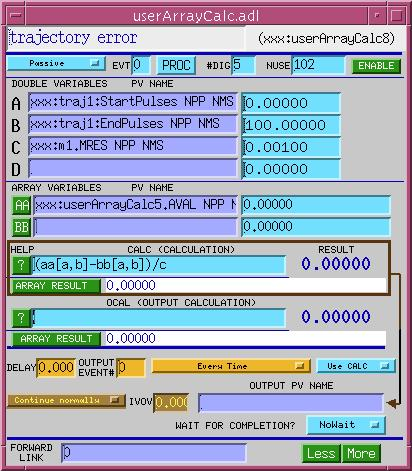

# aCalcout - Array Calculation Output Record

## Contents

1. [Introduction](#1-introduction)
2. [Scan Parameters](#2-scan-parameters)
3. [Array-size Parameters](#3-array-size-parameters)
4. [Input Links](#4-input-links)
5. [Expressions](#5-expressions)
   - [5.1. Operands](#51-operands)
   - [5.2. Algebraic Functions/Operators](#52-algebraic-functionsoperators)
   - [5.3. Trigonometric Functions](#53-trigonometric-functions)
   - [5.4. Relational Operators](#54-relational-operators)
   - [5.5. Logical Operators](#55-logical-operators)
   - [5.6. Bitwise Operators](#56-bitwise-operators)
   - [5.7. Separators](#57-separators)
   - [5.8. If-Else Expression](#58-if-else-expression)
   - [5.9. Array-specific Functions/Operators](#59-array-specific-functionsoperators)
   - [5.10. Argument-array Operators](#510-argument-array-operators)
   - [5.11. Miscellaneous Operators](#511-miscellaneous-operators)
   - [5.12. Examples](#512-examples)
6. [Output Parameters](#6-output-parameters)
7. [Display Parameters](#7-display-parameters)
8. [Alarm Parameters](#8-alarm-parameters)
9. [Monitor Parameters](#9-monitor-parameters)
10. [Run-time Parameters](#10-run-time-parameters)
11. [Record Support Routines](#11-record-support-routines)
    - [init_record](#init_record)
    - [process](#process)
    - [special](#special)
    - [get_value](#get_value)
    - [get_units](#get_units)
    - [get_precision](#get_precision)
    - [get_graphic_double](#get_graphic_double)
    - [get_control_double](#get_control_double)
    - [get_alarm_double](#get_alarm_double)
12. [Record Processing](#12-record-processing)
    - [12.1. process()](#121-process)
    - [12.2. execOutput()](#122-execoutput)

---

*Note: Some aspects of this record, and of the calc engine that it uses, are
experimental. While the scalar functions and operators are probably fairly
stable, array operators and functions described here are not guaranteed to exist
in future versions of this software, or to behave in exactly the same way. For
example, the function that takes the derivative of an array currently expects a
single array argument, and constructs an artificial independent variable array;
probably a future version will require that two arrays be specified.*

## 1. Introduction

The Array Calculation Output or "aCalcout" record is derived from the sCalcout
(string calcout) record, which, in turn, is derived from the calcout record. The
aCalcout record extends the calcout record by supporting array operands and
expressions in addition to scalar operands and expressions. The record has 12
array fields (AA...LL) used as input variables for the expression, and it calls
an extended version of the EPICS calculation engine that knows about arrays.
Soft device support supplied with the aCalcout record writes array or scalar
data to the record's output link, depending on the number of elements of the
field to which it is linked.

Here's a sample MEDM display of some of the the aCalcout record fields.



---

## 2. Scan Parameters

The aCalcout record has the standard fields for specifying under what
circumstances the record will be processed.  See the EPICS Record Reference
Manual for these fields and their use.

---

## 3. Array-size Parameters

The aCalcout record allocates NELM elements for its arrays the first time they
are used. This is the maximum number of array elements, and it applies to all
arrays.  NELM must be specified at boot time, before any array is used.

The number of elements actually used is specified as NUSE.  The value of NUSE
will forced into the range 0,NELM (inclusive).  If NUSE==0, the record will take
it as NELM.

When a CA client connects to an array, the acalcout record can tell the
client that the array size is either NELM, or NUSE, depending on the setting of
the SIZE field, which takes values "NELM" and "NUSE".  "NELM" is the default,
and it's the safer choice.  "NELM" is less efficient than "NUSE", in some cases.
If SIZE is set to "NUSE", the CA connection must be broken and reestablished
when the NUSE field increases.

| Field | Summary | Type | DCT | Initial | Access | Modify | Rec Proc Monitor |
| --- | --- | --- | --- | --- | --- | --- | --- |
| NELM | Number of allocated array elements | DBF_ULONG | Yes | 1 | Yes | No | N/A |
| NUSE | Number of array elements actually to be used | DBF_ULONG | Yes | 0 | Yes | Yes | Yes |
| SIZE | Specified whether NELM or NUSE is the array size declared to clients | MENU("NELM","NUSE") | Yes | "NELM" | Yes | Yes | N/A |

---

## 4. Input Links

The aCalcout record has 24 links with which it fetches values for use in expressions: 12 to
scalar fields (INPA -> A, INPB -> B, . . . INPL -> L); and 12 to array fields
(INAA -> AA, INBB -> BB, ...INLL -> LL). The fields can be database links,
channel access links, or (scalar-fields only) constants. These link fields
cannot be hardware addresses. In addition, the aCalcout record contains the
fields INAV, INBV, . . . INLV, which indicate the status of the links to scalar
fields, and the fields IAAV, IBBV, . . . ILLV, which indicate the status of the
links to array fields.  These fields indicate whether or not the specified
PV was found and a link to it established. See [Section 7,
*Display Parameters*](#7-display-parameters) for an explanation of these fields.

See the EPICS Record Reference Manual for information on how to specify
database links.

| Field | Summary | Type | DCT | Initial | Access | Modify | Rec Proc Monitor |
| --- | --- | --- | --- | --- | --- | --- | --- |
| INPA | Input Link A | INLINK | Yes | 0 | Yes | Yes | N/A |
| INPB | Input Link B | INLINK | Yes | 0 | Yes | Yes | N/A |
| ... | ... | ... | ... | ... | ... | ... | ... |
| INPL | Input Link L | INLINK | Yes | 0 | No | No | N/A |
| INAA | Input Link AA | INLINK | Yes | 0 | Yes | Yes | N/A |
| INBB | Input Link BB | INLINK | Yes | 0 | Yes | Yes | N/A |
| ... | ... | ... | ... | ... | ... | ... | ... |
| INLL | Input Link LL | INLINK | Yes | 0 | Yes | Yes | N/A |

---

## 5. Expressions

Like the Calcout record, the aCalcout record has a CALC field into which you can
enter an expression for the record to evaluate when it processes.  The resulting
scalar value will be placed in the VAL field, and the resulting array value
will be placed in the AVAL field.  VAL can then be used by the OOPT field (see
[Section 6, *Output Parameters*](#6-output-parameters)) to determine
whether or not to write to the output link or post an output event. Either VAL
and AVAL can also be written to the output link.  (If you elect to write an
output value, the record will choose between VAL and AVAL, depending on the data
type of the field at the other end of the output link.)

The CALC expression is converted to opcodes and stored in postfix
notation in the RPCL field.  It is the postfix expression which is actually
evaluated when the record processes.  When the CALC field is changed at
run-time, the record-support routine `special()` calls a function
to check it and convert it to postfix.

The record also has a second set of calculation-related fields described in
[Section 6, *Output Parameters.*](#6-output-parameters)

| Field | Summary | Type | DCT | Initial | Access | Modify | Rec Proc Monitor | PP |
| --- | --- | --- | --- | --- | --- | --- | --- | --- |
| CALC | Calculation | STRING[80] | Yes | 0 | Yes | Yes | Yes | No |
| VAL | Value | DOUBLE | No | 0 | Yes | Yes | Yes | No |
| RPCL | Postfix | NOACCESS | No | 0 | No | No | N/A | No |
| AVAL | Array value | DOUBLE | No | 0 | Yes | Yes | Yes | No |

Expressions supported by the array calculation record can involve scalar
and/or array operands, algebraic operators and functions, trigonometric
functions, relational operators, logical operators, array operators and
functions, parentheses and commas, and the conditional '?:' operator. All are
described in sections to follow, but first, we need to talk about how  operators
and functions behave when presented with scalar, array, and mixed operands.

Unless otherwise stated, functions and operators behave as follows:

- One-argument functions and operators, when given an array-valued argument or
operand, operate on each array element individually, and return an array.

- Two-argument functions and operators, when given array-valued operands,
operate on pairs of elements and return an array.  (e.g., `aa+bb =
aa[0]+bb[0], aa[1]+bb[1],...`)

- If one argument of a two-argument function or operator is an array, and the
other argument is a scalar, the scalar argument is converted to an array by
repeating the scalar value.  Thus, the value of the expression `A*BB` is the array
`a*bb[0], a*bb[1], a*bb[3],...`

- Whenever an array must be converted implicitly to a scalar (e.g., for the
operators `?:`, `^`, `**`, `>>`, and
`<<`), the scalar value used is the value of the first array
element.  In the following expressions, the array argument will be converted implicitly to scalar **(experimental)**:

  - AA?BB:CC
  - AA^BB
  - AA\*\*BB
  - AA\>\>BB
  - AA\<\<BB

### 5.1. Operands

The expression can use the values retrieved from the input links as operands.
These values retrieved from the input links are stored in the A-L, and AA-LL
fields. The values to be used in the expression are simply referenced by the
field name. For example, the values obtained from the INPA link is stored in the
field A, and is referred to in an expression as 'A' (or 'a' -- case doesn't
matter).

The number of elements of the array operands AA-LL is set at boot time by
the field NELM.  If an array value is received by the record with more or fewer
elements, the array used by the aCalcout record will be truncated or padded at
the end with zeros.

| Field | Summary | Type | DCT | Initial | Access | Modify | Rec Proc Monitor | PP |
| --- | --- | --- | --- | --- | --- | --- | --- | --- |
| A | Input Value A | DOUBLE | No | 0 | Yes | Yes/No* | Yes | Yes |
| B | Input Value B | DOUBLE | No | 0 | Yes | Yes/No* | Yes | Yes |
| ... | ... | ... | ... | ... | ... | ... | ... | ... |
| L | Input Value L | DOUBLE | No | 0 | Yes | Yes/No* | Yes | Yes |
| AA | Input array AA | DOUBLE ARRAY | No | 0 | Yes | Yes/No* | Yes | Yes |
| BB | Input array BB | DOUBLE ARRAY | No | 0 | Yes | Yes/No* | Yes | Yes |
| ... | ... | ... | ... | ... | ... | ... | ... | ... |
| LL | Input array LL | DOUBLE ARRAY | No | 0 | Yes | Yes/No* | Yes | Yes |

\* If a valid input link is associated with this field, then the record will
not not permit it to be modified by a 'put' operation.

There are a few special operands not associated with input fields, but
defined by the record (more exactly, defined by the calc engine the record uses
to evaluate expressions).  All but `RNDM`, `NRNDM`, and `ARNDM` are
constants.

| Operand | Description |
|---------|-------------|
| PI | 3.141592654 |
| D2R | Degrees to radians (PI/180) |
| R2D | Radians to degrees (1/D2R) |
| S2R | Arc seconds to radians (D2R/3600) |
| R2S | Radians to arc seconds (1/S2R) |
| NRNDM | Random number from a normal (Gaussian) distribution about 0, with a standard deviation of 1. |
| RNDM | Random number between 0 and 1. |
| ARNDM | Array of random numbers between 0 and 1. |
| IX | The array (0,1,2,...,NUSE). |
| VAL | The previous value of the VAL field. (In an OCAL expression, "VAL" is the previous value of the OVAL field.) |
| AVAL | The previous value of the AVAL field. (In an OCAL expression, "AVAL" is the previous value of the OAV field.) |

### 5.2. Algebraic Functions/Operators

| Op | Description | Example |
|----|-------------|---------|
| ABS | Absolute value (one-argument function) | `ABS(A)` |
| DBL | Convert (array) to double (one-argument function) | `DBL(AA)` |
| FINITE | True if all arguments are finite (variable-argument function) | `FINITE(A,B,...)` |
| ISINF | True if argument is infinite (one-argument function) | `ISINF(A)` |
| ISNAN | True if argument is not a number (one-argument function) | `ISNAN(A)` |
| SQRT | Square root (one-argument function) (SQR is deprecated) | `SQRT(A)` |
| MIN | Minimum (variable-argument function) | `MIN(A,B,...)` |
| MAX | Maximum (variable-argument function) | `MAX(A,B,...)` |
| CEIL | Ceiling (one-argument function) | `CEIL(A)` |
| FLOOR | Floor (one-argument function) | `FLOOR(A)` |
| INT | Nearest integer (one-argument function) | `INT(A)` |
| NINT | Nearest integer (one-argument function) | `NINT(A)` |
| APOS | Positive component. If negative, then zero (one-argument function) | `APOS(A)` |
| ANEG | Negative component. If positive, then zero (one-argument function) | `ANEG(A)` |
| LOG | Log base 10 (one-argument function) | `LOG(A)` |
| LN | Natural logarithm (one-argument function) | `LN(A)` |
| LOGE | Deprecated synonym for 'LN' | `LOGE(A)` |
| EXP | Exponential function (unary) | `EXP(A)` |
| ^ | Exponential (binary) (Same as '\*\*'.) | `A^B` |
| \*\* | Exponential (binary) (Same as '^'.) | `A**B` |
| + | Addition (binary) | `A+B` |
| - | Subtraction (binary) | `A-B` |
| \* | Multiplication (binary) | `A*B` |
| / | Division (binary) | `A/B` |
| % | Modulo (binary) | `A%B` |
| - | Negate (unary) | `-A` |
| NOT | Negate (unary) | `NOT A` |
| >? | Max (binary) | `A>?B` |
| <? | Min (binary) | `A<?B` |

### 5.3. Trigonometric Functions

| Op | Description | Example |
|----|-------------|---------|
| SIN | Sine (one-argument function) | `SIN(A)` |
| SINH | Hyperbolic sine (one-argument function) | `SINH(A)` |
| ASIN | Arc sine (one-argument function) | `ASIN(A)` |
| COS | Cosine (one-argument function) | `COS(A)` |
| COSH | Hyperbolic cosine (one-argument function) | `COSH(A)` |
| ACOS | Arc cosine (one-argument function) | `ACOS(A)` |
| TAN | Tangent (one-argument function) | `TAN(A)` |
| TANH | Hyperbolic tangent (one-argument function) | `TANH(A)` |
| ATAN | Arc tangent (one-argument function) | `ATAN(A)` |
| ATAN2 | Alternate form of arctangent (two-argument function) | `ATAN2(A,B)` |

### 5.4. Relational Operators

| Op | Description | Example |
|----|-------------|---------|
| >= | Greater than or equal to | `A>=B` |
| > | Greater than | `A>B` |
| <= | Less than or equal to | `A<=B` |
| < | Less than | `A<B` |
| != | Not equal to (same as '#') | `A!=B` |
| # | Not equal to (same as '!=') | `A#B` |
| == | Equal to (same as '=') | `A==B` |
| = | Equal to (same as '==') | `A=B` |

### 5.5. Logical Operators

| Op | Description | Example |
|----|-------------|---------|
| && | Logical AND | `A&&B` |
| \|\| | Logical OR | `A\|\|B` |
| ! | Logical NOT | `!A` |

### 5.6. Bitwise Operators

| Op | Description | Example |
|----|-------------|---------|
| \| | Bitwise OR | `A|B` |
| OR | Bitwise OR | `A OR B` |
| & | Bitwise AND | `A&B` |
| AND | Bitwise AND | `A AND B` |
| XOR | Bitwise Exclusive OR | `A XOR B` |
| ~ | One's Complement | `~A` |
| \<\< | Left shift | `A<<B` |
| \>\> | Right shift | `A>>B` |

### 5.7. Separators

The open and close parentheses are supported.  Nested parenthesis are supported.
Square and curly brackets are not available for use as separators, because they
are being used as operators.

The comma is supported when used to separate the arguments of a binary
function.

Spaces may occur between expression elements.  Space is required between
elements that would otherwise be parsed incorrectly.  The parser always attempts
to match the largest string of characters that constitute a recognized operator
or variable. For example, `A AND B` could be shortened to `A ANDB`,
because `ANDB` will be parsed as `AND B`.  However,
`A AND B` may not be shortened to `AAND B`, because
`AAND` would be parsed as `AA ND`.

### 5.8. If-Else Expression

The C language's if-else ("`?:`") operator is supported. The format is:

```
 <expression> ? <expression-true result> : <expression-false  result>
```

### 5.9. Array-specific Functions/Operators

Most of the functions and operators that can work with arrays are simple
generalizations of functions and operators that work with scalars. Such
functions are not listed here.  In this section are those functions or operators
that apply only to arrays, and whose behavior is not a simple element-by-element
rendition of some scalar function.

| Op | Description | Example |
|----|-------------|---------|
| [ | Subarray | `AA[1,3] -> aa(1),aa(2),aa(3)` |
| { | Subarray in place | `AA[1,3] -> 0, aa(1),aa(2),aa(3), 0,...` |
| \>\> | Array shift right. Move array elements by index. If index is not an integer, the array is interpolated to move by the fractional part. | `AA>>2` |
| \<\< | Array shift left. Move array elements by index. If index is not an integer, the array is interpolated to move by the fractional part. | `AA<<2` (same as `AA>>-2`) |
| AMIN | Minimal element of array (one-argument function) | `AMIN(AA) -> scalar` |
| AMAX | Maximal element of array (one-argument function) | `AMAX('a','b','c') -> 'c'` |
| ARR | Convert argument to array (one-argument function) | `ARR(1) -> 1, 1, 1,...` |
| AVG | Average of array values | `AVG(AA)=SUM(AA)/arraySize`, `AVG(AA[4,9])=SUM(AA[4,9])/6` |
| CAT | Concatenate array subranges, or an array subrange and a double value. If the second argument is a scalar, it is not converted to an array before being appended to the first argument. Note that CAT does nothing if its first argument is not a subrange, because a full array has no free space in which to append new values. | `CAT(AA[0,2],BB[0,2])`, `CAT(AA[0,2],B)` |
| CUM | Running sum of array values. For example, if AA=(1,2,3), CUM(AA)=(1,3,6). | `CUM(AA)` |
| DERIV | Derivative of array values, with respect to array index. Equivalent to NDERIV(AA,2). | `DERIV(AA)` |
| FWHM | Full width at half max of array values | `FWHM(AA)` |
| FITPOLY | (Deprecated. Use FITQ.) Fit array to second order polynomial a + b\*x + c\*x^2. | `FITPOLY(AA)` |
| FITMPOLY | (Deprecated. Use FITMQ.) Fit masked array to second order polynomial. First argument is input-data array, second argument is the mask array. If mask-array element value is true (greater than zero), corresponding data-array element will be used to compute best-fit polynomial a + b\*x + c\*x^2. | `FITPOLY(AA,AA>0)` |
| FITQ | Fit array to quadratic a + b\*x + c\*x^2, and optionally return fit coefficients. If the second, third, and fourth arguments are specified as the names of double variables, fit coefficients will be stored to those acalcoutRecord fields, in the order a,b,c. If any of the second, third, and fourth arguments is an array variable, it will be ignored. | `FITQ(AA)`, `FITQ(AA,J,K,L)` |
| FITMQ | Fit masked array to quadratic, and optionally return fit coefficients. First argument is input-data array, second argument is the mask array. If mask-array element value is true (greater than zero), corresponding data-array element will be used to compute best-fit polynomial a + b\*x + c\*x^2. If the third, fourth, and fifth arguments are specified as the names of double variables, fit coefficients will be stored to those acalcoutRecord fields, in the order a,b,c. If any of the second, third, and fourth arguments is an array variable, it will be ignored. | `FITMQ(AA,AA>0)`, `FITMQ(AA,AA>0,J,K,L)` |
| IX | The array (0,1,2,3,...,NUSE) | `IX(AA)` |
| IXMAX | The index of the largest (most positive) element of the array. | `IXMAX(AA)` |
| IXMIN | The index of the smallest (most negative) element of the array. | `IXMIN(AA)` |
| IXZ | The (floating-point) index of the first zero crossing in the array, calculated by linear interpolation. | `IXZ(AA)` |
| IXNZ | The index of the first nonzero element of the array. (The first element whose absolute value is greater than 1.e-9.) | `IXNZ(AA)` |
| NDERIV | Derivative of array values, with respect to array index. Derivative is calculated in the following way: at each array point, fit N surrounding array points to a second-order polynomial, take the derivative of the polynomial analytically, and evaluate it at the index of the array point. The number of points, on either side of the array point, to be used in the fit, is specified by the second argument to NDERIV(). (I.e., if N is specified, 2\*N+1 points will be fit.) Array elements less than N points from the beginning or end of the array will get a less effectively calculated derivative, since the fit will not be centered on the point. | `NDERIV(AA,B)` |
| NSMOO | Smooth array values, using multiple applications of SMOO() | `NSMOO(AA,B)` |
| STD | Standard deviation of array values | `STD(AA)` |
| SMOO | Smooth array values, using a 5-point binomial formula y'(i) = y(i-2)/16 + y(i-1)/4 + 3\*y(i)/8 + y(i+1)/4 + y(i+2)/16 | `SMOO(AA)` |
| SUM | Sum of array values. | `SUM(AA)` |

### 5.10. Argument-array Operators

These operators represent the scalar/array fields of the aCalcout record as
arrays of scalars/arrays.  They are an alternative way of specifying
the fields A-L and AA-LL.

| Op | Description | Example |
|----|-------------|---------|
| @ | Scalar array element. Regard the numeric fields A-L as an array whose elements are numbered 0-11, and return the element whose number follows. Thus, `@0` is another way of saying `A`. (unary operator) | `@A` |
| @@ | Array array element. Regard the array fields AA-LL as an array of arrays whose elements are numbered 0-11, and return the element whose number follows. Thus, `@@1` is another way of saying `BB`. (unary operator) | `@@A` |

### 5.11. Miscellaneous Operators

| Op | Description | Examples |
|----|-------------|----------|
| := | Store value of right hand side in location specified by left hand side. (binary) | `A:=1.2`, `@7:=3`, `AA:=IX`, `@@4:=sin(IX)` |
| UNTIL | Execute expression until its value is TRUE. (binary) The total number of iterations is limited to the ioc-shell variable sCalcLoopMax, which defaults to 1000. | `until(1)`, `until(a:=a+1;b:=b-1;b<1)` |

### 5.12. Examples

#### Algebraic

`A + B + 10`

Result is `A + B + 10`

---

#### Relational

`(A + B) < (C + D)`

Result is `1` if `(A+B) < (C+D)`

Result is `0` if `(A+B) >= (C+D)`

---

#### If-Else

`(A+B)<(C+D)?E:F+L+10`

Result is `E` if `(A+B) < (C+D)`

Result is `F+L+10` if `(A+B) >= (C+D)`

`(A+B)<(C+D)?E`

Result is `E` if (A+B) < (C+D)

Result is unchanged if `(A+B) >= (C+D)`

---

#### Logical

`A&B`

Causes the following to occur:

- Convert `A` to integer
- Convert `B` to integer
- Perform bit-wise `AND` of `A` and `B`
- Convert result to floating point

---

#### Array

Notation:  I'll use `(1,2,3)` to indicate an array.  Note that
[1,2] is not an array, but the subrange operator with arguments 1 and 2.
The subrange operator must follow an array, like so: `AA[2,5]`.
Similarly, {1,2} is not an array, but the subrange-in-place operator.

`A + AA`

where A=1 and AA = (1,2,3)

Result is `(2,3,4)`.

`A + DBL(AA)`

where A=1 and AA=(1,2,3)

Result is `2`.  DBL returns the first array element.

`AA+BB`

where AA=(1,2,3) and BB=(7,8,9)

Result is `(8,10,12)`.  Element-by-element sum.  Most operators
behave in this way.

`AA[2,4]`

where AA = (1,2,3,4,5)

Result is `(3,4,5)`.  (The first element of an array is
numbered "0".)

`AA[-3,-1]`

where AA=(1,2,3,4)

Result is `(2,3,4)`.  (The last element of an array is
numbered "-1".)

`AA{2,4}`

where AA = (1,2,3,4,5,6)

Result is `(0,0,3,4,5,0)`.  (Similar to the [] operator,
but the selected subrange is left in place.)

---

#### Argument array

`@0`

Result is the value of the numeric variable `A`.  ("`@0`"
is just another name for `A`.)

`@@0`

Result is the value of the array variable AA.

`@(A+B)`

Result is the value of the numeric variable whose number is given by the sum
of A and B.

---

#### Store

The "Store" operator is the only array-calc operator that does not produce a
value.  Thus, the expression `a:=0` is an incomplete and therefore illegal calc expression,
because it leaves us with nothing to write to the record's `VAL` field.

`A:=A-1;7`

Evaluate the expression `A-1`, store the result in the input
variable `A`, set the VAL field to 7.

`@0:=A-1;7`

Same as above, because `@0` is just another name for `A`

`D:=0;@D:=A-1;7`

Same as above, because `D==0`.

`AA:=IX;7`

Overwrite the array input variable `AA` with the array (0,1,2...), and set the VAL field to 7.

`AA:=IX;b:=0;1`

Multiple store expressions, separated by ';' terminators, are legal at top
level, but - as always - the expression as a whole must produce a value.  This expression
produces the value `1`.

`A+(AA:="abc";b:=0;1)`

Multiple store expressions are also legal within parentheses, and again the
parenthesized subexpression must produce a value.  The parenthesized
subexpression in this example produces the value `1`, which is added to
`A`.

`@0:=A-1;7`

Evaluate the expression `A-1`, store the result in the input
variable `A`, and set the VAL field to 7.

---

#### Loop ("UNTIL")

The `UNTIL` function evaluates its expression repeatedly until the
expression returns a nonzero value, or the allowed number of iterations
`sCalcLoopMax` has been reached.  When looping is done, or aborted,
the expression value is returned.

`UNTIL(1)`

The expression 1 is evaluated, terminates the loop, and is returned.  This
do-nothing expression is equivalent to `(1)`.

`B:=10;UNTIL(B:=B-1;B<1)`

This do-almost-nothing
expression initializes B to 10, decrements it repeatedly until its value is
zero, and returns the value 1 (True).

`BB:=1; B:=1; AA:=BB; UNTIL(AA:=AA+(BB>>B); B:=B+1; B>10)`

Initialize `BB` to `(1,1,1...)`.  Loop to integrate
over `BB`, so that the N'th element of `AA` will be the
sum of all elements of `BB[0,N]`.
This expression is useful for
converting an array of step pulses accumulated by a multichannel scaler into an
array of positions at which the multichannel scaler's channel-advance signal was
triggered.  (The "CUM" function does this operation.)

`AA:=0;L:=0;UNTIL(AA:=CAT(AA[0,L],@L);L:=L+1;L>9);AA:=AA<<1`

Copy the 10 scalar input fields `A-J` to the first 10 elements of the array `AA`.

(This quite an inefficient way to do the job.  An asub record would be much more efficient.)

`L:=0;AA:=IX;UNTIL(@L:=AA[L,L];L:=L+1;L>10)`

Copy the first 10 elements of `AA` to the scalar input variables `A-J`.

(Again, this is quite an inefficient way to do the job.)

---

Here's a more complete example of array calcs in use.  Suppose we want to
analyze results from a series of edge scans to find the conditions that produce
the sharpest edge.  Lacking any hardware, we'll also have to make fake data to
analyze.  We'll use three aCalcout records:

- `aCalc1` to compute artificial edge-scan data,
- `aCalc2` to take the derivative of that data,
- `aCalc3` to compute the FWHM of the derivative.

Here are field values that do the job:

```
aCalc1.CALC = "tanh((ix-a)/b)+c*arndm"
aCalc1.A = <edge position>
aCalc1.B = <edge width control>
aCalc1.C = <amount of noise added to data>
aCalc1.OUT = "aCalc2.AA PP"

aCalc2.CALC = "nderiv(aa,20)"
aCalc2.OUT = "aCalc3.AA PP"

aCalc3.CALC = "fwhm(aa)"
```

---

## 6. Output Parameters

These parameters specify and control the output capabilities of the
aCalcout record. They determine when to write the output, where to write
it, and what the output will be. The OUT link specifies the Process Variable
to which the result will be written. The OOPT field determines the condition
that causes the output link to be written to. It's a menu field that has
six choices:

`Every Time` -- write output every time record is processed.

`On Change` -- write output every time VAL changes, i.e., every
time the result of the expression changes.

`When Zero` -- when record is processed, write output if VAL is
zero.

`When Non-zero` -- when record is processed, write output if VAL
is non-zero.

`Transition to Zero` -- when record is processed, write output only
if VAL is zero and last value was non-zero.

`Transition to Non-zero` -- when record is processed, write output
only if VAL is non-zero and last value was zero.

`Never` -- Don't write output ever.

The DOPT field determines what data is written to the output link when the
output is executed. The field is a menu field with two options: `Use
CALC` or `Use OCAL`. If `Use CALC` is specified, when the
record writes its output it will write the result of the expression in the CALC
field, that is, it will write the value of the VAL [AVAL] field to a scalar
[array] destination. If `Use OCAL` is specified, the record will instead
write the result of the expression in the OCAL field, which result is contained
in the OVAL field (array result in the OAV field). The OCAL field is exactly
analogous to the CALC field and has the same functionality: it can contain an
expression which is evaluated at run-time. Thus, if necessary, the record can
use the result of the CALC expression to determine if data should be written and
can use the result of the OCAL expression as the data to write.

If the OEVT field specifies a non-zero integer and the condition in the
OOPT field is met, the record will post a corresponding event. If the ODLY field
is non-zero, the record pauses for the specified number of seconds before
executing the OUT link or posting the output event. During this waiting period
the record is "active" and will not be processed again until the wait is over.
The field DLYA is equal to 1 during the delay period. The resolution of the
delay entry is one clock tick, where the clock frequency is defined elsewhere
(see `epicsThreadSleepQuantum()` in the *EPICS Application Developer's Guide*).

The IVOA field specifies what action to take with the OUT link
if the aCalcout record enters an INVALID alarm status. The options are
`Continue normally`, `Don't drive outputs`, and `Set output
to IVOV`. If the IVOA field is `Set output to IVOV`, the data
entered into the IVOV field is written to the OUT link if the record alarm
severity is INVALID.

| Field | Summary | Type | DCT | Initial | Access | Modify | Rec Proc Monitor | PP |
| --- | --- | --- | --- | --- | --- | --- | --- | --- |
| OUT | Output Specification | OUTLINK | Yes | 0 | Yes | Yes | N/A | No |
| OOPT | Output Execute Option | Menu | Yes | 0 | Yes | Yes | No | No |
| DOPT | Output Data Option | Menu | Yes | 0 | Yes | Yes | No | No |
| OCAL | Output Calculation | STRING[36] | Yes | Null | Yes | Yes | No | No |
| OVAL | Output Value | DOUBLE | No | 0 | Yes | Yes | Yes | No |
| OEVT | Event To Issue | SHORT | Yes | 0 | Yes | Yes | No | No |
| ODLY | Output Execution Delay | FLOAT | Yes | 0 | Yes | Yes | No | No |
| IVOV | Invalid Output Action | Menu | Yes | 0 | Yes | Yes | No | No |
| IVOA | Invalid Output Value | DOUBLE | Yes | 0 | Yes | Yes | No | No |
| OAV | Output array value | DOUBLE ARRAY | NO | 0 | Yes | Yes | Yes | No |
| WAIT | Wait for completion? | Menu | Yes | "NoWait" | Yes | Yes | Yes | No |

The aCalcout record uses device support to write to the
`OUT` link. Soft device supplied with the record is selected with
the .dbd specification
```
field(DTYP,"Soft Channel")
```

This device support uses the record's `WAIT` field to determine
whether to wait for completion of processing initiated by the `OUT`
link before causing the record to execute its forward link.  The mechanism by
which this waiting for completion is performed requires that the
`OUT` link have the attribute `CA` -- i.e., the link text
looks something like

`xxx:record.field CA NMS`

Currently, the record does not try to ensure that `WAIT` and
`OUT` are compatibly configured.  If `WAIT` == "Wait",
but the link looks like

`xxx:record.field PP NMS`

for example, then the record will not wait for completion before executing
its forward link.

---

## 7. Display Parameters

These parameters are used to present meaningful data to the operator.
Some are also meant to represent the status of the record at run-time.
An example of an interactive MEDM display screen that displays the status
of the aCalcout record is located here.

The EGU field contains a string of up to 16 characters which is
supplied by the user and which describes the values being operated upon.
The string is retrieved whenever the routine `get_units` is called.
The EGU string is solely for an operator's sake and does not have to be
used.

The HOPR and LOPR fields only refer to the limits of the VAL,
HIHI, HIGH, LOW, and LOLO fields. PREC controls the precision of the VAL
field.

The INAV-INLV and IAAV-ILLV fields indicate the status of the
link to the PVs specified in the INPA-INPL and INAA-INLL fields, respectively.
The fields can have three possible values.

The OUTV field indicates the status of the OUT link. It has the same possible
values as the INAV-INLV fields.

The CLCV and OLCV fields indicate the validity of the expression
in the CALC and OCAL fields, respectively. If the expression is invalid,
the field is set to one.

The DLYA field is set to one during the delay interval specified
in ODLY.

See the EPICS Record Reference Manual, for more on the record name (NAME) and
description (DESC) fields.

| Field | Summary | Type | DCT | Initial | Access | Modify | Rec Proc Monitor | PP |
| --- | --- | --- | --- | --- | --- | --- | --- | --- |
| EGU | Engineering Units | STRING [16] | Yes | Null | Yes | Yes | No | No |
| PREC | Display Precision | SHORT | Yes | 0 | Yes | Yes | No | No |
| HOPR | High Operating Range | FLOAT | Yes | 0 | Yes | Yes | No | No |
| LOPR | Low Operating Range | FLOAT | Yes | 0 | Yes | Yes | No | No |
| INAV | Link Status of INPA | Menu | No | 1 | Yes | No | No | No |
| INBV | Link Status of INPB | Menu | No | 1 | Yes | No | No | No |
| ... | ... | ... | ... | ... | ... | ... | ... | ... |
| INLV | Link Status of INPL | Menu | No | 1 | Yes | No | No | No |
| OUTV | OUT PV Status | Menu | No | 0 | Yes | No | No | No |
| CLCV | CALC Valid | LONG | No | 0 | Yes | Yes | No | No |
| OCLV | OCAL Valid | LONG | No | 0 | Yes | Yes | No | No |
| DLYA | Output Delay Active | USHORT | No | 0 | Yes | No | No | No |
| NAME | Record Name | STRING [29] | Yes | 0 | Yes | No | No | No |
| DESC | Description | STRING [29] | Yes | Null | Yes | Yes | No | No |
| IAAV | Link Status of INAA | Menu | No | 1 | Yes | No | No | No |
| IBBV | Link Status of INBB | Menu | No | 1 | Yes | No | No | No |
| ... | ... | ... | ... | ... | ... | ... | ... | ... |
| ILLV | Link Status of INLL | Menu | No | 1 | Yes | No | No | No |

---

## 8. Alarm Parameters

The possible alarm conditions for the aCalcout record are the SCAN,
READ, Calculation, and limit alarms. The SCAN and READ alarms are called
by the record support routines. The Calculation alarm is called by the
record processing routine when the CALC expression is an invalid one, upon
which an error message is generated.

The following alarm parameters which are configured by the user
define the limit alarms for the VAL field and the severity corresponding
to those conditions.

The HYST field defines an alarm deadband for each limit. See the
EPICS Record Reference Manual for a complete explanation of alarms
and these fields.

| Field | Summary | Type | DCT | Initial | Access | Modify | Rec Proc Monitor | PP |
| --- | --- | --- | --- | --- | --- | --- | --- | --- |
| HIHI | Hihi Alarm Limit | FLOAT | Yes | 0 | Yes | Yes | No | Yes |
| HIGH | High Alarm Limit | FLOAT | Yes | 0 | Yes | Yes | No | Yes |
| LOW | Low Alarm Limit | FLOAT | Yes | 0 | Yes | Yes | No | Yes |
| LOLO | Lolo Alarm Limit | FLOAT | Yes | 0 | Yes | Yes | No | Yes |
| HHSV | Severity for a Hihi Alarm | Menu | Yes | 0 | Yes | Yes | No | Yes |
| HSV | Severity for a High Alarm | Menu | Yes | 0 | Yes | Yes | No | Yes |
| LSV | Severity for a Low Alarm | Menu | Yes | 0 | Yes | Yes | No | Yes |
| LLSV | Severity for a Lolo Alarm | Menu | Yes | 0 | Yes | Yes | No | Yes |
| HYST | Alarm Deadband | DOUBLE | Yes | 0 | Yes | Yes | No | No |

---

## 9. Monitor Parameters

These parameters are used to determine when to send monitors for the
value fields. The monitors are sent when the value field exceeds the last
monitored field by the appropriate deadband, the ADEL for archiver monitors
and the MDEL field for all other types of monitors. If these fields have
a value of zero, every time the value changes, monitors are triggered;
if they have a value of -1, every time the record is scanned, monitors
are triggered.

| Field | Summary | Type | DCT | Initial | Access | Modify | Rec Proc Monitor | PP |
| --- | --- | --- | --- | --- | --- | --- | --- | --- |
| ADEL | Archive Deadband | DOUBLE | Yes | 0 | Yes | Yes | No | No |
| MDEL | Monitor, i.e. value change, Deadband | DOUBLE | Yes | 0 | Yes | Yes | No | No |

---

## 10. Run-time Parameters

These fields are not configurable using a configuration tool and none
are modifiable at run-time. They are used to process the record.

The LALM field is used to implement the hysteresis factor for
the alarm limits.

The LA-LL fields are used to decide when to trigger monitors for
the corresponding fields. For instance, if LA does not equal the value
for A, monitors for A are triggered. The MLST and MLST fields are used
in the same manner for the VAL field.

| Field | Summary | Type | DCT | Initial | Access | Modify | Rec Proc Monitor | PP |
| --- | --- | --- | --- | --- | --- | --- | --- | --- |
| LALM | Last Alarmed Value | DOUBLE | No | 0 | Yes | No | No | No |
| ALST | Archive Last Value | DOUBLE | No | 0 | Yes | No | No | No |
| MLST | Monitor Last Value | DOUBLE | No | 0 | Yes | No | No | No |
| LA | Previous Input Value for A | DOUBLE | No | 0 | Yes | No | No | No |
| LB | Previous Input Value for B | DOUBLE | No | 0 | Yes | No | No | No |
| ... | ... | ... | ... | ... | ... | ... | ... | ... |
| LL | Previous Input Value for A | DOUBLE | No | 0 | Yes | No | No | No |
| LAA | Previous Input Value for AA | DOUBLE ARRAY | No | 0 | Yes | No | No | No |
| LBB | Previous Input Value for BB | DOUBLE ARRAY | No | 0 | Yes | No | No | No |
| ... | ... | ... | ... | ... | ... | ... | ... | ... |
| LLL | Previous Input Value for LL | DOUBLE ARRAY | No | 0 | Yes | No | No | No |

---

## 11. Record Support Routines

#### init_record

For each constant input link, the corresponding value field is initialized
with the constant value if the input link is CONSTANT or a channel access
link is created if the input link is PV_LINK.

A routine postfix is called to convert the infix expression in
CALC and OCAL to reverse polish notation. The result is stored in RPCL
and ORPC, respectively.

#### process

See section 12.

#### special

This is called if CALC or OCAL is changed. special calls aCalcPostfix.

#### get_value

Fills in the values of struct valueDes so that they refer to VAL.

#### get_units

Retrieves EGU.

#### get_precision

Retrieves PREC.

#### get_graphic_double

Sets the upper display and lower display limits for a field. If the field
is VAL, HIHI, HIGH, LOW, or LOLO, the limits are set to HOPR and LOPR,
else if the field has upper and lower limits defined they will be used,
else the upper and lower maximum values for the field type will be used.

#### get_control_double

Sets the upper control and the lower control limits for a field. If the
field is VAL, HIHI, HIGH, LOW, or LOLO, the limits are set to HOPR and
LOPR, else if the field has upper and lower limits defined they will be
used, else the upper and lower maximum values for the field type will be
used.

#### get_alarm_double

Sets the following values:

- upper_alarm_limit = HIHI
- upper_warning_limit = HIGH
- lower_warning_limit = LOW
- lower_alarm_limit = LOLO

---

## 12. Record Processing

### 12.1. process()

The `process()` routine implements the following algorithm:

1. Fetch all arguments.

2. Call routine aCalcPerform(), which calculates VAL from the postfix version
of the expression given in CALC. If aCalcPerform() returns success, UDF
is set to FALSE.

3. Check alarms. This routine checks to see if the new VAL causes the alarm
status and severity to change. If so, NSEV, NSTA and LALM are set. It also
honors the alarm hysteresis factor (HYST). Thus the value must change by
at least HYST before the alarm status and severity changes.

4. Determine if the Output Execution Option (OOPT) is met. If it is met,
either execute the output link (and output event) immediately (if ODLY
= 0), or schedule a callback to do so after the specified interval. See the
explanation for the `execOutput()` routine below.

5. Check to see if monitors should be invoked.

   - Alarm monitors are invoked if the alarm status or severity has changed.
   - Archive and value change monitors are invoked if ADEL and MDEL conditions are met.
   - Monitors for A-L and AA-LL are checked whenever other monitors are invoked.
   - NSEV and NSTA are reset to 0.

6. If no output delay was specified, scan forward link if necessary, set
PACT FALSE, and return.

### 12.2. execOutput()

1. If DOPT field specifies the use of OCAL, call the routine aCalcPerform
for the postfix version of the expression in OCAL. Otherwise, use VAL.

2. If the Alarm Severity is INVALID, follow the option as designated by
the field IVOA.

3. If the Alarm Severity is not INVALID or IVOA specifies "Continue Normally",
call device support to write the value of OVAL to device or PV specified by
the OUT link, and post the event in OEVT (if non-zero).

4. If an output delay was implemented, process the forward link.

---

Tim Mooney
