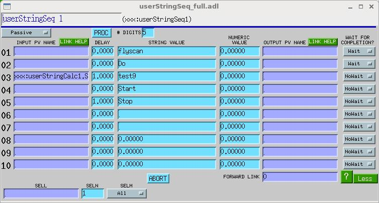
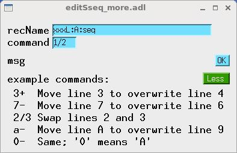

# The sseq (string sequence) record

## Contents

1. [Introduction](#1-introduction)
2. [Scan/Control Fields](#2-scancontrol-fields)
3. [Desired Output Fields](#3-desired-output-fields)
4. [Output/Wait Fields](#4-outputwait-fields)
5. [Selection Algorithm Fields](#5-selection-algorithm-fields)
6. [Delay Fields](#6-delay-fields)
7. [Operator Display Fields](#7-operator-display-fields)
8. [Alarm Fields](#8-alarm-fields)
9. [Record Support Routines](#9-record-support-routines)
10. [Editing a sseq record at run time](#10-editing-a-sseq-record-at-run-time)

---

## 1. Introduction

The **sseq** (String Sequence) record is derived from the **seq** (Sequence) record, and has all of its capabilities. In addition, the **sseq** record can read from either string or numeric fields, and write to either string or numeric fields; it can wait for processing that any of its output links triggers to complete; and its execution can be aborted. The record can execute a sequence of up to ten sets of *delay/get-value/put-value/wait-for-completion* operations. All steps and sequences are optional; with default field values, the record does nothing at all. Like the **seq** record, the **sseq** record implements several selection algorithms that allow a database programmer, or run-time user, to specify which sets of *delay/get/put/wait* to execute. The record has no associated device support.

The **sseq** record's execution can be aborted by the user. When this happens, the record will immediately stop causing other records to process, but it cannot abort any execution it already started with one of its links. Also, aborting the **sseq** record will not prevent it from executing its forward link. If you want to chain two **sseq** records together and have the whole sequence abortable, chain them with a `LNKn` field, rather than the `FLNK` field.

Beginning with std-module version R3-0, the *string field* mentioned above can be either a PV of type `DBF_STRING`, or an array PV whose elements are of type `DBF_CHAR` or `DBF_UCHAR`. In any case, the length that will be read or written by the **sseq** record is limited to the first 39 characters, because the sseq record uses EPICS string PVs internally.

Beginning with std-module version R3-0, the **sseq** record posts the states of its input and output links (but not its forward link), and posts PVs that indicate which output links are waiting for callbacks.

Beginning with std-module version R3-2, and calc-module version R3-0, the **sseq** record moved from the std module to the calc module.

To write successfully to a DBF_MENU or DBF_ENUM (for example, the VAL field of a `bo` or `mbbo` record) the record's string value must be one of the possible strings for the PV, or it must an integer specifying the string number [0..N] for the PV. For example, when writing to a `bo` record whose ZNAM is "No" and whose ONAM is "Yes", the string value must be one of the following: "No", "Yes", "0", and "1". To ensure that numeric values are converted to integers, set the precision (the PREC field) to zero.

Here's a sample MEDM display of some of the the sseq record fields. Each "line" in the display consists of the fields `DOLn`, `DLYn`, `STRn`, `DOn`, `LNKn`, and `WAITn`, from left to right.



---

## 2. Scan/Control Fields

Like all other EPICS records, the sequence record has the standard set of fields (`SCAN`, `PINI`, `FLNK`, `PROC`, etc.) for specifying when or under what circumstances it should process, and what record, if any, should process immediately afterward. See the *EPICS Record Reference Manual* for more information.

In addition to standard control fields, the **sseq** record has the field, `ABORT`:

| Field | Summary | Type | DCT | Initial | Access | Modify | Rec Proc Monitor | PP |
|-------|---------|------|-----|---------|--------|--------|------------------|----|
| ABORT | Abort execution | SHORT | No | 0 | Yes | Yes | Yes | No |

The user, or another EPICS record, can cause a running **sseq** record to stop executing links by writing '1' to the record's `ABORT` field. The `ABORT` field will remain '1' until the record has finished aborting, at which time the field will be reset to '0'. Only the execution of the record itself will stop when it is aborted. Any processing that the record has already started (via its links) will be unaffected by the abort, and the forward link will be executed in any case.

The first write of '1' to the abort field waits for outstanding callbacks to arrive before returning the record to the idle state. This is the preferred way to abort an executing sequence. However, it may be that a callback the record is waiting for will never arrive. In this case, a more thorough abort is required, to put the record back into an executable state. Therefore, if a second write of '1' to the abort field occurs while the record is waiting for callbacks, the record will abandon outstanding callbacks, and return immediately to the idle state. However, any abandoned callbacks remain outstanding, and can arrive at any time. If one comes in while the record is idle, it will be ignored, but if it comes in while the record is executing a fresh sequence, it may be treated as the result of that fresh sequence.

> It has become common practice for EPICS developers to treat a sequence record's forward link as an extra `LNKn` field, and to chain a series of sequence records together using forward links. These practices are not recommended for use with the **sseq** record, because the forward link is not subject to `ABORT`; it is *always* executed.

> For previous versions of the record (earlier than std-module version R3-0), users were cautioned not to write to the `ABORT` the record via a `PP` link, because this could cause EPICS to reprocess the record after the abort had succeeded. The record now defends itself against this possibility, by clearing its `RPRO` field as the last step of an abort.

---

## 3. Desired Output Fields

These link fields hold the values the record is to write to other records, or determine from where those values are to be read.

The sequence record can fetch up to 10 values from 10 locations. The user specifies the locations in the Desired Output Link fields (`DOL1-DOLA`), which can be either numeric constants or links to other EPICS PVs. If a Desired Output Link is a numeric constant, the corresponding value field for that link is initialized to the constant value. Otherwise, if the Desired Output Link is a string, it is assumed to represent a link, a value is fetched from the link each time the record is processed. See the *EPICS Record Reference Manual* for information on how to specify database links. If you want to initialize a string value, use `STRn`. For example, to write a database file that initializes the string `STR1` (the string that will be written by `LNK1`) to `"abcdefg"`, include the bold line below:

```
record(sseq,"mySeqRecord") {
    ...
    field("STR1","abcdef")
    ...
}
```

The values fetched from the Desired Output Links are stored in the corresponding Desired Output fields (`DO1-DOA` and `STR1-STRA`). These fields can be initialized by a database configuration tool, and they can be changed at run time. But note that the value of `DOn` and `STRn` will be overwritten if `DOLn` is a valid link (i.e., if `DOLn` contains the name of a PV to which the **sseq** record is able to make a channel-access connection).

Many EPICS records that have a `DOL` link field also have an `OMSL` (Output Mode Select) field, which determines whether or not the `DOL` field is used. Like the **seq** record, the **sseq** record has no such field. Its `DOLn` fields are treated as links if they contain text that could be a PV name, and value fields are overwritten if those links successfully retrieve values.

| Field | Summary | Type | DCT | Initial | Access | Modify | Rec Proc Monitor | PP |
|-------|---------|------|-----|---------|--------|--------|------------------|----|
| DOL1...DOLA | Desired Output Link | INLINK | Yes | 0 | Yes | Yes | N/A | No |
| DOL1V...DOLAV | Desired Output Link Valid | MENU ("Ext PV NC", "Ext PV OK", "Local PV", "Constant") | No | 0 | Yes | No | Yes | No |
| DO1...D0A | Desired Output Value | DOUBLE | No | 0 | Yes | Yes | No | No |
| STR1...STRA | Desired Output String | STRING | No | 0 | Yes | Yes | No | No |

---

## 4. Output/Wait Fields

When the **sseq** record is processed, desired output values (`DOn` or `STRn`) are written to the corresponding output links (`LNKn`). These output links should either be blank (in which case no writing will occur), or contain the name of an EPICS PV; they may not be device addresses. There are ten output links. Only those that contain valid PV names are used. If a link field contains a PV name to which a CA connection cannot be made, the rest of the record currently continues to operate as though the unconnected link field were blank. (This is probably not a good practice, and it is not guaranteed to persist as the record is improved.)

EPICS links can cause processing of the linked-to (i.e., target) record to occur. Whether or not processing actually does occur depends on both the specification of the link, and the properties of the target record. This is well documented in the *EPICS Application Developer's Guide*, but since some details of link behavior are essential prerequisites for an understanding of the **sseq** record's `WAITn` fields, the (EPICS 3.14) behavior of the output links, `LNKn`, is summarized here:

There are three possibilities:

**PP**
: If `LNKn` has the attribute `PP` (e.g., "`targetRecord.field PP NMS`"), then the link will attempt to cause `targetRecord` to process. The attempt will succeed, however, only if the target record is "Passive" (e.g., `targetRecord.SCAN` has the value `Passive`). In other words, `PP` means "process if passive".

**CA**
: If `LNKn` has the attribute `CA` (e.g., "`targetRecord.field CA NMS`"), then `targetRecord` will process only if `field` has been designated by `targetRecord`'s record-support code as a "Process Passive" field. You can tell if a field is "Process Passive" either by looking at the record's .dbd file, or by writing to it from any Channel Access client; if the record processes when the field in question is written to via Channel Access, then the field is Process Passive, and a `CA` link to that field from the **sseq** record will also cause the record to process.

**NPP**
: If `LNKn` has the attribute `NPP`, then `targetRecord` will not process as a result of `LNKn`.

The **sseq** record is permitted to demand a completion callback from EPICS only if the output-link field it's processing has the attribute `CA`. A `PP` link is not permitted to make this demand. If `LNKn` does have the `CA` attribute, and `WAITn` has the value `Wait`, then the **sseq** record will demand a completion callback. In this case, it will wait after firing `LNKn` for the callback, before moving on to the next group of `DLY`/`DOL`/`LNK` fields. If `LNKn` has any attribute other than 'CA', `WAITn` is irrelevant and its value will be ignored.

If `LNKn` has the attribute `CA`, and `WAITn` has the value `Wait`, but `targetRecord.field` is *not* a Process-Passive field, then `targetRecord` will not process as a result of `LNKn`, but the **sseq** record will immediately receive a completion callback anyway, and will therefore not wait for `targetRecord` to process.

Finally, if the **sseq** record successfully waits for `targetRecord` to finish processing, it is still possible for other records to process as an *indirect* result of `LNKn`, and the **sseq** record cannot wait for this indirectly caused processing to finish unless the database developer has arranged for the indirectly caused processing to be traceable by EPICS. For example, a channel access client may have a monitor on the field the **sseq** record writes to, and may do something when that field's value changes. EPICS cannot trace this processing without special help from a database developer. This issue is covered in depth in the documentation of the **sscan** record, which also relies on EPICS execution tracing to determine when processing it has caused finishes. (See "Completion Reporting" in the Powerpoint presentation "Scans.ppt" in the synApps **sscan** module's documentation directory.)

| Field | Summary | Type | DCT | Initial | Access | Modify | Rec Proc Monitor | PP |
|-------|---------|------|-----|---------|--------|--------|------------------|----|
| LNK1...LNKA | Output link | OUTLINK | Yes | blank | Yes | Yes | N/A | No |
| LNK1V...LNKAV | Output Link Valid | MENU ("Ext PV NC", "Ext PV OK", "Local PV", "Constant") | No | 0 | Yes | No | Yes | No |
| WAIT1...WAITA | Wait Command | MENU ("NoWait", "Wait", "After1", ..., "After10") | Yes | "NoWait" | Yes | Yes | N/A | No |
| WERR1...WERRA | Wait Configuration Error | short (0:ok; 1:error) | No | 0 | Yes | No | Yes | No |

These fields determine whether the **sseq** record waits for completion of processing started by an output link, and at what point in the sequence the record waits. If `WAITn` has any value other than "NoWait", the record will wait. To accomplish this, the record will attempt to execute `LNKn` in such a way that the record will be notified when all processing started by the link has finished. This attempt can succeed only if the link has the attribute "CA".

If `WAITn` has the value "Wait", the record will wait for completion before going on to the next action.

If `WAITn` has the value "After*i*", where *i* is in [1,10], then the record will process actions up to and including action *i* before waiting for completion.

Thus, for example, if you want to execute links 1 and 2 in quick succession, and then wait for completion of processing started by both links, before moving on to link 3, you would set `WAIT1` to "After2", and set `WAIT2` to either "Wait" or "After2". (For link *n*, "Wait" means the same thing as "After*n*").

The sseq record cannot go back in time. If you specify "After2" for link 3, the record will behave as though you had specified "Wait" or (equivalently) "After3".

The `WERRn` fields are purely for the user's information, and indicate whether or not the `WAITn` field is consistent with the link attribute specified for the `LNKn` field. If you want the record to wait for completion of a link, that link must have the attribute 'CA'. The record doesn't enforce this; it just tells you if there's a problem.

| Field | Summary | Type | DCT | Initial | Access | Modify | Rec Proc Monitor | PP |
|-------|---------|------|-----|---------|--------|--------|------------------|----|
| WTG1...WTGA | Waiting | SHORT | No | 0 | Yes | No | Yes | No |

These fields display the waiting states of their respective links. While the record is waiting for completion of processing started by a link, this field will have the value 1.

To avoid any misunderstanding, let me emphasize that `WAITn` fields do not control or affect the **sseq** record's use of its delay (`DLYn`) fields. `WAITn` only controls whether the record will wait for processing started by `LNKn` to complete. Thus, if `WAITn` is 0, the record will execute `LNKn` and immediately pause for `DLY(n+1)` seconds before executing `LNK(n+1)`; if `WAITn` is 1, the record will execute `LNKn`, wait for processing started by `LNKn` to complete, and *then* pause for `DLY(n+1)` seconds.

By the way, because the **sseq** record can write strings, it can be used to write to link fields (its own, or those of another record). This use can succeed only if the link field doing the writing has the attribute `CA`.

---

## 5. Selection Algorithm Fields

When the **sseq** record is processed, it uses a selection algorithm similar to that of the sel (selection) record to decide which links to process. The select mechanism field (`SELM`) provides three algorithms to choose from: `All`, `Specified` or `Mask`.

**`All`**
: All link groups are processed, in order from 1 to 10. Thus, if `DOL1` or `LNK1` is connected, record will wait for `DLY1` seconds, fetch the desired output value from `DOL1` (if `DOL1` contains a PV name), place it in DO1 and `STR1`, and send it `LNK1` (if `LNK1` contains a PV name), optionally waiting for completion. Then the record will move on to process `DLY2`, `DOL2`, `DO2`, `STR2`, `LNK2`, `WAIT2`, and so on until the last input and output link `DOA` and `LNKA`. The `SELN` field is not used when `SELM` = `All`.

**`Specified`**
: Each time the record is processed it will get the integer value in the Link Selection (`SELN`) field and uses that as the index of the link group to process. For instance, if `SELN` is 4, the desired output value from `DO4` will be fetched and sent to `LNK4`. If `DOLn` is a constant, `DOn` is simply used without the value being fetched from the input link.

**`Mask`**
: Each time the record is processed, the record uses the integer value from the `SELN` field as a bit mask to determine which link groups to process. For example, if `SELN` is 1, then the value from `DO1` will be written to the location in `LNK1`. If `SELN` is 3, the record will fetch the values from `DO1` and `DO2` and write them to the locations in `LNK1` and `LNK2`, respectively. If `SELN` is 63 (0x3F), `DO1`...`DO6` will be written to `LNK1`...`LNK6`.

| Field | Summary | Type | DCT | Initial | Access | Modify | Rec Proc Monitor | PP |
|-------|---------|------|-----|---------|--------|--------|------------------|----|
| SELM | Select Mechanism | RECCHOICE | Yes | 0 | Yes | Yes | No | No |
| SELN | Link Selection | USHORT | No | 1 | Yes | Yes | No | No |
| SELL | Link Selection Location | INLINK | Yes | 0 | No | No | N/A | No |

---

## 6. Delay Fields

There are ten delay-related fields, one for each I/O link discussed above. These fields cause the record to delay processing before fetching data from the associated input link, or writing to the associated output link. For example, if the user gives the `DLY1` field a value of 3.0, each time the record is processed at run-time, the record will delay processing for three seconds before fetching data from the `DOL1` link. If neither an input or an output link exist, the associated delay will be ignored.

Delays are implemented with a time granularity of the system clock, which typically has a frequency of 60 Hz. When a delay value is specified, the record rounds it to the nearest multiple of the system clock period, and writes it back to the `DLYn` field.

| Field | Summary | Type | DCT | Initial | Access | Modify | Rec Proc Monitor | PP |
|-------|---------|------|-----|---------|--------|--------|------------------|----|
| DLY1 | Delay time | DOUBLE | Yes | 0 | Yes | Yes | No | No |
| DLY2 | Delay time | DOUBLE | Yes | 0 | Yes | Yes | No | No |
| ... | ... | ... | ... | ... | ... | ... | ... | ... |
| DLYA | Delay time | DOUBLE | Yes | 0 | Yes | Yes | No | No |

---

## 7. Operator Display Fields

These fields are used to present meaningful data to the operator. The Precision field (`PREC`) determines the decimal precision for the `VAL` field when it is displayed. It is used when the `get_precision` record routine is called.

See the *EPICS Record Reference Manual* for more on the record name (`NAME`) and description (`DESC`) fields.

| Field | Summary | Type | DCT | Initial | Access | Modify | Rec Proc Monitor | PP |
|-------|---------|------|-----|---------|--------|--------|------------------|----|
| PREC | Display Precision | SHORT | Yes | 0 | Yes | Yes | No | No |
| NAME | Record Name | STRING [29] | Yes | 0 | Yes | No | No | No |
| DESC | Description | STRING [29] | Yes | Null | Yes | Yes | No | No |
| BUSY | Sequence active | SHORT | No | 0 | Yes | No | Yes | No |

---

## 8. Alarm Fields

The sequence record has the alarm fields common to all record types. See the *EPICS Record Reference Manual* for details.

---

## 9. Record Support Routines

The only record support routine is process.

1. First, `PACT` is set to `TRUE`, and the link selection is fetched. Depending on the selection mechanism, the link selection output links are processed in order from `LNK1` to `LNKA`. When `LNKn` is processed, the corresponding `DLYn` value is used to generate a delay via watchdog timer.

2. After `DLYn` seconds have expired, the input value is fetched from `DOn` (if `DOLn` is constant) or `DOLn` (if `DOLn` is a database link or channel access link) and written to `LNKn`.

3. When all links are completed, an asynchronous completion call back to dbProcess is made (see the *EPICS Application Developer's Guide* for more information on asynchronous processing.)

4. Then `UDF` is set to `FALSE`.

5. Monitors are checked.

6. The forward link is scanned, `PACT` is set `FALSE`, and the process routine returns.

For the delay mechanism to operate properly, the record is processed asynchronously. The only time the record will not be processed asynchronously is when there are no non-NULL output links selected (i.e. when it has nothing to do.) The processing of the links is done via callback tasks at the priority set in the `PRIO` field in dbCommon (see the *EPICS Application Developer's Guide* for more information.

---

## 10. Editing a sseq record at run time

Editing sseq record fields (rearranging lines in the sequence, inserting new lines, etc.) is a tedious and error prone process, because sseq-record fields can refer to each other. For example, the `WAIT1` field can have the value "After3", so that the record will wait for the operation started by `LNK1` before processing line 4. If the lines 1-3 are moved to lines 2-4, then one would like for `WAIT2` to be set to to "After4", to preserve the old behavior of lines 1-3. Also, `LNK` and `DOL` fields can refer to `DO` and `STR` fields, and one would want these to be modified as well.

**editSseq** does all these things, with a simple command-based interface. Here's a sample MEDM display of editSseq:



To accomplish the change described above (move lines 1-3 of a sseq record to lines 2-4 of the same record), one would do the following:

1. Type the record name into the `recName` field. (Or use DragAndDrop; editSseq will strip off the field name.)
2. Type `3+` into the `command` field.
3. Type `2+` into the `command` field.
4. Type `1+` into the `command` field.

editSseq also works on seq records.

To use editSseq, add the following commands to an ioc's startup file:

1. `dbLoadRecords("$(CALC)/calcApp/Db/editSseq.db", "P=xxx:,Q=ES:")`
2. `seq &editSseq, "P=xxx:,Q=ES:"`

and add the following menu item to an MEDM display file:

```
display[0] {
    label="editSseq"
    name="editSseq.adl"
    args="P=xxx:,Q=ES:"
}
```
