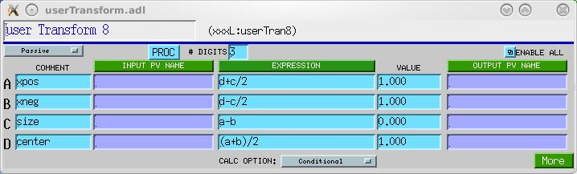
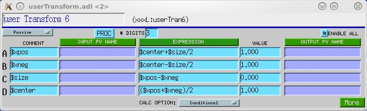

# Transform Record and related software

Tim Mooney

---

## Contents

1. [Overview](#overview)
2. [Background](#background)
3. [Expressions](#expressions)
   - [Synonyms](#synonyms)
4. [Field Descriptions](#field-descriptions)
5. [Files](#files)
6. [Restrictions](#restrictions)
7. [Release notes](#release-notes)

---

## Overview

This documentation describes version 5.8, and earlier, of the EPICS transform record, and related EPICS software recommended for building and using it. Version 5.8 is compatible with EPICS Release 3.14.x, and it may be compatible with later releases, but it is not compatible with any earlier releases of EPICS.

The TRANSFORM record combines features of the CALC and SEQUENCE records, with 16 sets of the following fields:

- **input link** - INPA...INPP
- **input-link status** - IAV...IPV
- **input/output value** - A...P
- **expression** - CLCA...CLCP
- **output link** - OUTA...OUTP
- **output-link status** - OAV...OAP
- **comment** - CMTA...CMTP

There are guaranteed rules governing the sequence and conditions under which expressions are evaluated. Each time the record is processed, the following sequence occurs:

1. Values are fetched, in order A through P, from all valid input links. That is, if INPA is a valid input link, the value of the field pointed to by INPA will be placed into the field A, and so on.

   > Note: If the record is in link alarm (.NSEV >= INVALID_ALARM) after all input-link values have been fetched, and if .IVLA == "Do Nothing", then the record will quit processing at this point. It will do some clean up, but it will not execute its forward link.

2. Valid expressions are evaluated in order CLCA through CLCP, and the resulting values are placed into the corresponding fields, A through P. Expressions are not always evaluated, however:

   If COPT=="Conditional" (0; the default value), then expression CLC*x* is evaluated only if *x* is "old", as defined below. In other words, new values are regarded as independent variables in the set of equations CLCA...CLCP, and unchanged/unwritten values are regarded as dependent variables.

   If COPT=="Always" (1), all valid expressions are evaluated unconditionally.

   > The value field *x* is "old" if it has the same value it had after the last time the record was processed, and it was not written to (either by an outside agent or by the input link, INP*x*) since the last time the record was processed.
   >
   > Note that this means you cannot use both INPA and CLCA, unless you set COPT=="Always".
   >
   > Note that writes received while PACT==1 are special: they will change the field they write to, but they will not be regarded as writes for the purpose of determining whether a value is "new". This rule allows a transform record to write to itself (using database links) without messing up its notion of which values are new.
   >
   > Prior to version 5.8, there was no COPT field, and the record always behaved as though COPT=="Conditional".

3. Valid output links are triggered in order OUTA through OUTP---regardless of whether the corresponding values have changed. That is, if OUTA is a valid link, the value in field A is poked into the field pointed to by OUTA, and so on.

The transform record uses the expression-evaluation software sCalcPostfix.c and sCalcPerform.c, originally developed for the sCalcout record. An expression may contain any of the functions and constants that are valid for the sCalcout record (including string functions, though a final string result will of course be converted to double); any of the letters A-P, which stand for the values of the corresponding fields in the instant before the expression is evaluated; the expression @n, where n is an integer in [0-15], or an expression that yields such an integer, stands for a value A-P; and any of the constants PI (3.14159265), R2D (180/PI), D2R (PI/180), S2R (D2R/3600), and R2S (R2D*3600).

## Background

The TRANSFORM record was originally intended to perform the sequences of conditional calculations required to implement bidirectional coordinate transformations.

Example: You have defined two records containing values we'll call "L" and "R" (the left and right edges of a slit, say). Sometimes the user wants to control L and R individually, and sometimes he wants to control a combination of L and R--say (L-R) and (L+R)/2, the width and center of the slit system. You can implement a bidirectional coordinate transformation with the following expressions (where position values are assumed to increase as we go from left to right):

| field | expression | comment |
|-------|-----------|---------|
| A | C-D/2 | position of left edge of slit |
| B | C+D/2 | position of right edge of slit |
| C | (A+B)/2 | position of center of slit |
| D | B-A | width of slit |

Now, if a user command moves the left side of the slit (A changes) and causes the record to process, A will not be recalculated because it's value is new, the right side of the slit will remain still (B is unnecessarily recalculated from old values of C and D), the position of the slit center (C) will change as expected, and the slit width (D) will change as expected. Thus, all four fields will contain consistent information about the two degrees of freedom controlled by the record, and effectively we have two actual devices and two virtual devices.

We don't care which two fields (out of A..D) correspond to actual motion-control devices, and two channel-access clients that make different assumptions about how a slit should be implemented can control this slit without modification. With an additional, similar transform record driven from the readback fields of the actual motion-control devices, we can calculate readback values for the virtual devices as well.

We could have accomplished nearly the same effect with six CALC records and some FANOUTs, but two of the drive fields (A,B,C,D) would always be inconsistent with their readbacks.

## Expressions

Expressions for the transform record are described in [sCalcoutRecord.md](sCalcoutRecord.md), because the transform record uses the same expression evaluation software.

### Synonyms

In addition to conventional expression, like "A+B", you can specify *synonyms* for the variables "A" through "P", as demonstrated below:





To specify a synonym for the variable "A", you begin the comment field "CMTA" with the synonym, which must begin with '$', and which is terminated by the first nonalphanumeric character. For example, in the comment "$left:the left slit", the synonym is "$left".

## Field Descriptions

In addition to fields common to all record types (see the EPICS Record Reference Manual for these) the transform record has the fields described below.

---

### Alphabetical list of record-specific fields

| Name | Access | Prompt | Data type | Comment |
|------|--------|--------|-----------|---------|
| A | R/W(*) | Value A | DOUBLE | |
| B | R/W(*) | Value B | DOUBLE | |
| C | R/W(*) | Value C | DOUBLE | |
| CAV | R | Expression Invalid | LONG | Expression CLCA invalid if nonzero |
| CBV | R | Expression Invalid | LONG | Expression CLCB invalid if nonzero |
| CCV | R | Expression Invalid | LONG | Expression CLCC invalid if nonzero |
| CDV | R | Expression Invalid | LONG | Expression CLCD invalid if nonzero |
| CEV | R | Expression Invalid | LONG | Expression CLCE invalid if nonzero |
| CFV | R | Expression Invalid | LONG | Expression CLCF invalid if nonzero |
| CGV | R | Expression Invalid | LONG | Expression CLCG invalid if nonzero |
| CHV | R | Expression Invalid | LONG | Expression CLCH invalid if nonzero |
| CIV | R | Expression Invalid | LONG | Expression CLCI invalid if nonzero |
| CJV | R | Expression Invalid | LONG | Expression CLCJ invalid if nonzero |
| CKV | R | Expression Invalid | LONG | Expression CLCK invalid if nonzero |
| CLCA | R/W* | Expression A | STRING(120) | |
| CLCB | R/W* | Expression B | STRING(120) | |
| CLCC | R/W* | Expression C | STRING(120) | |
| CLCD | R/W* | Expression D | STRING(120) | |
| CLCE | R/W* | Expression E | STRING(120) | |
| CLCF | R/W* | Expression F | STRING(120) | |
| CLCG | R/W* | Expression G | STRING(120) | |
| CLCH | R/W* | Expression H | STRING(120) | |
| CLCI | R/W* | Expression I | STRING(120) | |
| CLCJ | R/W* | Expression J | STRING(120) | |
| CLCK | R/W* | Expression K | STRING(120) | |
| CLCL | R/W* | Expression L | STRING(120) | |
| CLCM | R/W* | Expression M | STRING(120) | |
| CLCN | R/W* | Expression N | STRING(120) | |
| CLCO | R/W* | Expression O | STRING(120) | |
| CLCP | R/W* | Expression P | STRING(120) | |
| CLV | R | Expression Invalid | LONG | Expression CLCL invalid if nonzero |
| CMTA | R/W | Comment | STRING(39) | |
| CMTB | R/W | Comment | STRING(39) | |
| CMTC | R/W | Comment | STRING(39) | |
| CMTD | R/W | Comment | STRING(39) | |
| CMTE | R/W | Comment | STRING(39) | |
| CMTF | R/W | Comment | STRING(39) | |
| CMTG | R/W | Comment | STRING(39) | |
| CMTH | R/W | Comment | STRING(39) | |
| CMTI | R/W | Comment | STRING(39) | |
| CMTJ | R/W | Comment | STRING(39) | |
| CMTK | R/W | Comment | STRING(39) | |
| CMTL | R/W | Comment | STRING(39) | |
| CMTM | R/W | Comment | STRING(39) | |
| CMTN | R/W | Comment | STRING(39) | |
| CMTO | R/W | Comment | STRING(39) | |
| CMTP | R/W | Comment | STRING(39) | |
| CMV | R | Expression Invalid | LONG | Expression CLCM invalid if nonzero |
| CNV | R | Expression Invalid | LONG | Expression CLCN invalid if nonzero |
| COPT | R/W | Calc option | MENU: 0=Conditional, 1=Always | Calcs performed conditionally, or always? |
| COV | R | Expression Invalid | LONG | Expression CLCO invalid if nonzero |
| CPV | R | Expression Invalid | LONG | Expression CLCP invalid if nonzero |
| D | R/W(*) | Value D | DOUBLE | |
| E | R/W(*) | Value E | DOUBLE | |
| EGU | R/W | Units name | STRING(16) | |
| F | R/W(*) | Value F | DOUBLE | |
| G | R/W(*) | Value G | DOUBLE | |
| H | R/W(*) | Value H | DOUBLE | |
| I | R/W(*) | Value I | DOUBLE | |
| IAV | R | Link Valid | MENU (see below) | Link INPA Valid if nonzero |
| IBV | R | Link Valid | MENU (see IAV) | Link INPB Valid if nonzero |
| ICV | R | Link Valid | MENU (see IAV) | Link INPC Valid if nonzero |
| IDV | R | Link Valid | MENU (see IAV) | Link INPD Valid if nonzero |
| IEV | R | Link Valid | MENU (see IAV) | Link INPE Valid if nonzero |
| IFV | R | Link Valid | MENU (see IAV) | Link INPF Valid if nonzero |
| IGV | R | Link Valid | MENU (see IAV) | Link INPG Valid if nonzero |
| IHV | R | Link Valid | MENU (see IAV) | Link INPH Valid if nonzero |
| IIV | R | Link Valid | MENU (see IAV) | Link INPI Valid if nonzero |
| IJV | R | Link Valid | MENU (see IAV) | Link INPJ Valid if nonzero |
| IKV | R | Link Valid | MENU (see IAV) | Link INPK Valid if nonzero |
| ILV | R | Link Valid | MENU (see IAV) | Link INPL Valid if nonzero |
| IMV | R | Link Valid | MENU (see IAV) | Link INPM Valid if nonzero |
| INPA | R/W | Input Link | LINK | |
| INPB | R/W | Input Link | LINK | |
| INPC | R/W | Input Link | LINK | |
| INPD | R/W | Input Link | LINK | |
| INPE | R/W | Input Link | LINK | |
| INPF | R/W | Input Link | LINK | |
| INPG | R/W | Input Link | LINK | |
| INPH | R/W | Input Link | LINK | |
| INPI | R/W | Input Link | LINK | |
| INPJ | R/W | Input Link | LINK | |
| INPK | R/W | Input Link | LINK | |
| INPL | R/W | Input Link | LINK | |
| INPM | R/W | Input Link | LINK | |
| INPN | R/W | Input Link | LINK | |
| INPO | R/W | Input Link | LINK | |
| INPP | R/W | Input Link | LINK | |
| INV | R | Link Valid | MENU (see IAV) | Link INPN Valid if nonzero |
| IOV | R | Link Valid | MENU (see IAV) | Link INPO Valid if nonzero |
| IPV | R | Link Valid | MENU (see IAV) | Link INPP Valid if nonzero |
| IVLA | R | Invalid Link Action | MENU: 0=Ignore error, 1=Do Nothing | Selects what to do if the record is in link alarm. "Do Nothing" means quit wrap up and quit executing after input values have been fetched. The forward link will not be processed in this case. |
| J | R/W(*) | Value J | DOUBLE | |
| K | R/W(*) | Value K | DOUBLE | |
| L | R/W(*) | Value L | DOUBLE | |
| LA | R | Prev Value of A | DOUBLE | |
| LB | R | Prev Value of B | DOUBLE | |
| LC | R | Prev Value of C | DOUBLE | |
| LD | R | Prev Value of D | DOUBLE | |
| LE | R | Prev Value of E | DOUBLE | |
| LF | R | Prev Value of F | DOUBLE | |
| LG | R | Prev Value of G | DOUBLE | |
| LH | R | Prev Value of H | DOUBLE | |
| LI | R | Prev Value of I | DOUBLE | |
| LJ | R | Prev Value of J | DOUBLE | |
| LK | R | Prev Value of K | DOUBLE | |
| LL | R | Prev Value of L | DOUBLE | |
| LM | R | Prev Value of M | DOUBLE | |
| LN | R | Prev Value of N | DOUBLE | |
| LO | R | Prev Value of O | DOUBLE | |
| LP | R | Prev Value of P | DOUBLE | |
| M | R/W(*) | Value M | DOUBLE | |
| MAP | R | Input bitmap | SHORT | |
| N | R/W(*) | Value N | DOUBLE | |
| O | R/W(*) | Value O | DOUBLE | |
| OAV | R | Link Valid | MENU (see IAV) | Link Valid if nonzero |
| OBV | R | Link Valid | MENU (see IAV) | Link Valid if nonzero |
| OCV | R | Link Valid | MENU (see IAV) | Link Valid if nonzero |
| ODV | R | Link Valid | MENU (see IAV) | Link Valid if nonzero |
| OEV | R | Link Valid | MENU (see IAV) | Link Valid if nonzero |
| OFV | R | Link Valid | MENU (see IAV) | Link Valid if nonzero |
| OGV | R | Link Valid | MENU (see IAV) | Link Valid if nonzero |
| OHV | R | Link Valid | MENU (see IAV) | Link Valid if nonzero |
| OIV | R | Link Valid | MENU (see IAV) | Link Valid if nonzero |
| OJV | R | Link Valid | MENU (see IAV) | Link Valid if nonzero |
| OKV | R | Link Valid | MENU (see IAV) | Link Valid if nonzero |
| OLV | R | Link Valid | MENU (see IAV) | Link Valid if nonzero |
| OMV | R | Link Valid | MENU (see IAV) | Link Valid if nonzero |
| ONV | R | Link Valid | MENU (see IAV) | Link Valid if nonzero |
| OOV | R | Link Valid | MENU (see IAV) | Link Valid if nonzero |
| OPV | R | Link Valid | MENU (see IAV) | Link Valid if nonzero |
| OUTA | R/W | Output Link | LINK | |
| OUTB | R/W | Output Link | LINK | |
| OUTC | R/W | Output Link | LINK | |
| OUTD | R/W | Output Link | LINK | |
| OUTE | R/W | Output Link | LINK | |
| OUTF | R/W | Output Link | LINK | |
| OUTG | R/W | Output Link | LINK | |
| OUTH | R/W | Output Link | LINK | |
| OUTI | R/W | Output Link | LINK | |
| OUTJ | R/W | Output Link | LINK | |
| OUTK | R/W | Output Link | LINK | |
| OUTL | R/W | Output Link | LINK | |
| OUTM | R/W | Output Link | LINK | |
| OUTN | R/W | Output Link | LINK | |
| OUTO | R/W | Output Link | LINK | |
| OUTP | R/W | Output Link | LINK | |
| P | R/W(*) | Value P | DOUBLE | |
| PREC | R/W | Display Precision | MENU | |
| RPCA-RPCP | R | Postfix Expression | CHAR * | |
| RPVT | R | Record private info | VOID * | |
| VAL | R/W | VAL field | DOUBLE | not used |
| VERS | R | Code Version | FLOAT | |

Notes on the **Access** column above:

| Access | Meaning |
|--------|---------|
| R | Read only |
| r | Read only, not posted |
| R/W | Read and write are allowed |
| R/W* | Read and write are allowed; channel-access write triggers record processing if the record's SCAN field is set to "Passive." |
| R/W(*) | Read and write are allowed; channel-access write triggers record processing if the corresponding trigger field (.xPP) is nonzero and record's SCAN field is set to "Passive." |

Note: Link Valid fields IxV and OxV actually take the following values:

- 0: "Ext PV NC" Link is to an external PV. Channel-access connection does not exist (yet?)
- 1: "Ext PV OK" Link is to an external PV. Channel-access connection exists.
- 2: "Local PV" Link is to a local PV.
- 3: "Constant" No PV name has been given for this link.

---

## Files

The following table briefly describes the files required to implement and use the transform record. The reader is assumed to be familiar with building EPICS.

### Source Code

Files to be placed in `<top>/<app>App/src/`

| File | Description |
|------|-------------|
| transformRecord.c | Record support code |
| transformRecord.dbd | Database definition file |
| sCalcPerform.c | string calculation support |
| sCalcPostfix.c | string calculation support |
| sCalcPostfix.h | string calculation support |
| sCalcPostfixPvt.h | string calculation support |

### Databases

Files to be placed in `<top>/<app>App/Db/`

| File | Description |
|------|-------------|
| userTransform.db | Sample transform-record database |
| userTransforms10.db | 10 transforms and an enable switch |
| userTransforms10_settings.req | save-restore request file for userTransforms10.db |

### MEDM Display Files

Files to be placed in `<top>/<app>App/op/adl/`

| File | Description |
|------|-------------|
| yyTransform.adl | Small control display for any transform record |
| yyTransform_full.adl | ...with more detail |
| userTransform.adl | Small control display for transform record enabled by the switch in userTransforms10.db |
| userTransform_full.adl | ...with more detail |
| userTransforms10.adl | Collection of userTransform callups, with overall enable switch |

These files build `medm` screens to access the transform record. To use one of them from the command line, type, for example:

```
medm -x -macro "P=xxx:,T=userTran1" yyTransform_full.adl
```

where `xxx:userTran1` is the name of the transform record.

### EPICS Startup Files

Files to be placed in `<top>/iocBoot/ioc<name>/`

| File | Description |
|------|-------------|
| st.cmd | Startup script |

This file is not included in the distribution. The following line added to st.cmd loads a single transform record.

```
dbLoadRecords("xxxApp/Db/userTransform.db","P=xxx:,N=1")
```

### Backup/Restore (BURT) Request File

Files to be placed in `<top>/<app>App/op/burt/`

| File | Description |
|------|-------------|
| yyTransformSettings.req | save settings of a specified transform record. This file is normally `#include`'d (once for each transform record) by other request files. |

### Autosave/Restore Request File

File to be placed in your autosave search path

| File | Description |
|------|-------------|
| transform_settings.req | save settings of a specified transform record. This file is normally included once for each transform record by other request files, with a line of the following form: `file transform_settings.req P=tmm:,T=userTran1` |
| userTransforms10_settings.req | save settings of the userTransforms10.db database. |

---

## Restrictions

None that I'm aware of.

---

## Release notes

Versions earlier than 5.8 did not have the COPT field.

Versions earlier than 5.7 did not post fields with the DBE_LOG attribute.

Versions earlier than 5.6 expected sCalcPostfix to allocate the postfix-expression array. sCalcPostfix no longer does this, and the transform record changed as a consequence.

Versions earlier than 5.5 ignored link errors. Beginning with version 5.5, you can choose to ignore link errors (the default) or to quit processing (after all input link values have been fetched and transferred to their respective value fields).

In versions earlier than 5.2, the test for old values did not correctly handle NaN values, which would always appear to be new, and would therefore never go away.

Versions earlier than 5.0 defined the additional fields APP...PPP, which determined whether or not a channel-access put to the value fields A...P, respectively, would cause the record to process. (The default value of these fields did not cause the record to process.) The mechanism used to accomplish this (scanOnce(), called from the transform record's special() routine) was incompatible with EPICS execution tracing software, dbPutNotify(), which must be able to discover from the .dbd file which fields of a record cause processing when written to via channel access. Because putNotify() has become an essential feature of EPICS in synchrotron-radiation applications (i.e., in synApps), the transform record was modified to remove the `<x>PP` fields, and the fields A..P were made process passive in transformRecord.dbd.

---

Suggestions and comments to:
[Tim Mooney](mailto:mooney@aps.anl.gov) : (mooney@aps.anl.gov)
